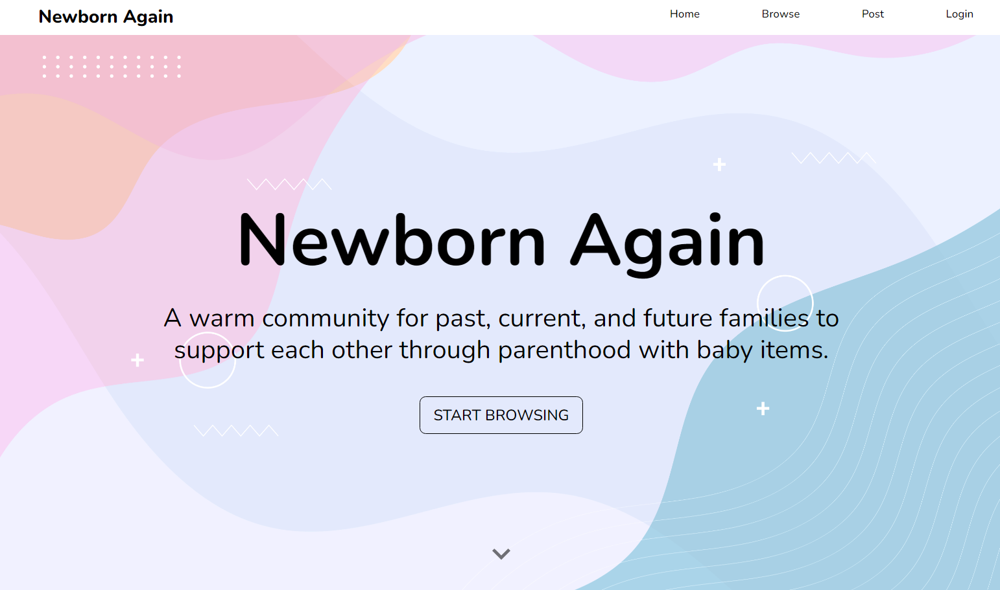
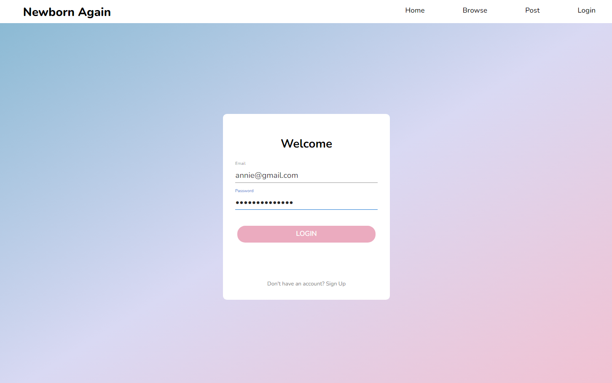
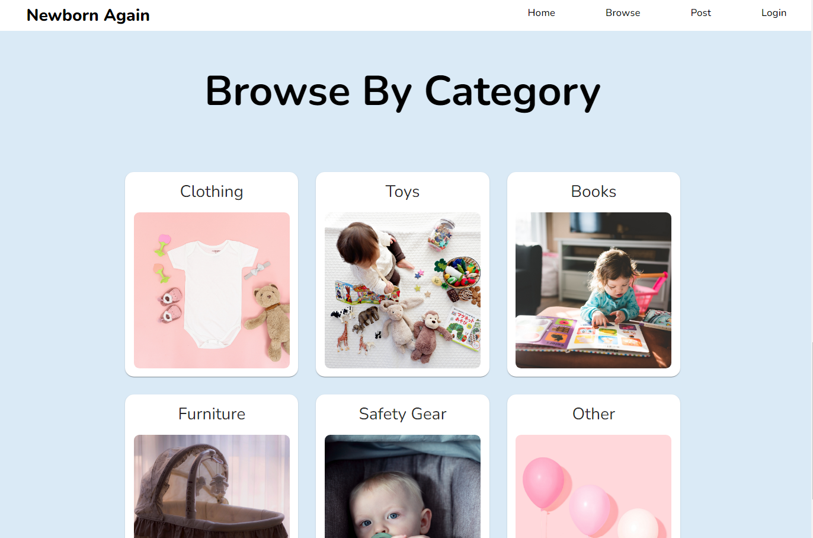
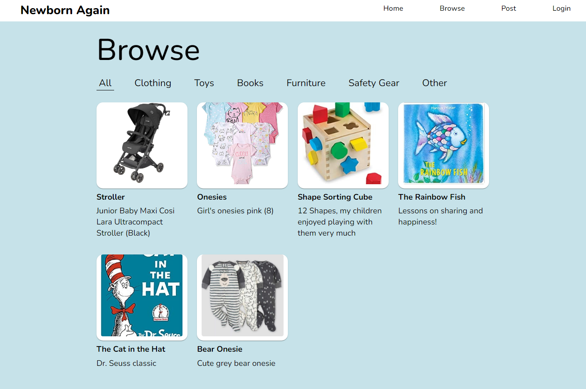
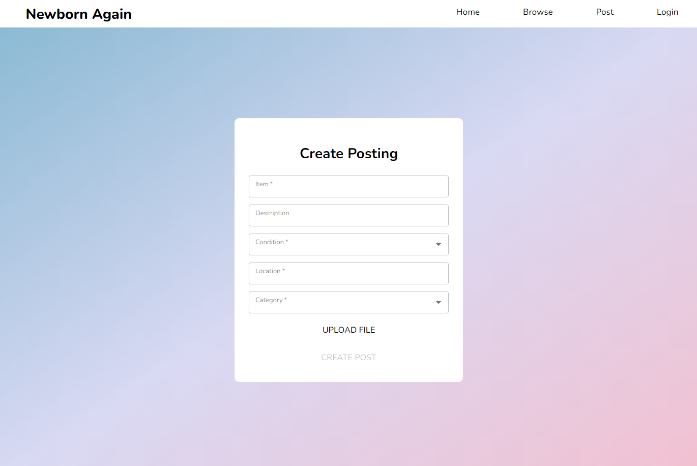
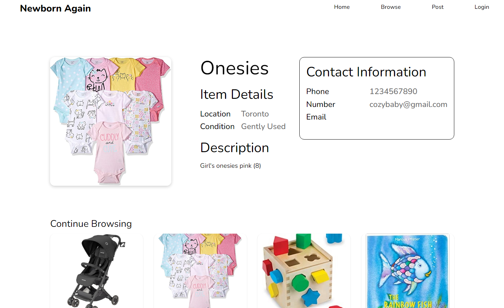

# Newborn Again 🐣

Newborn Again is an app for parents to donate their baby items to new parents. This project was created for WiCHacks 2023 using Node.js, React, Material UI, and Appwrite.

## Getting started

In the project directory, you can run:

### `npm start`

Runs the app in the development mode.
Open [http://localhost:3000](http://localhost:3000) to view it in your browser.

## Photo Gallery 🍼

